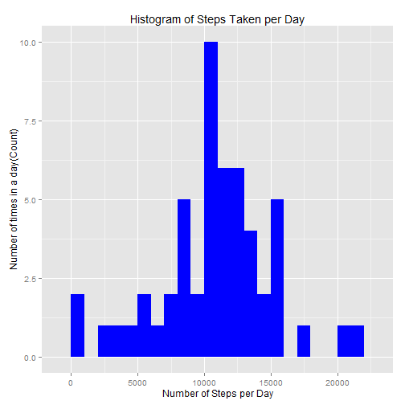
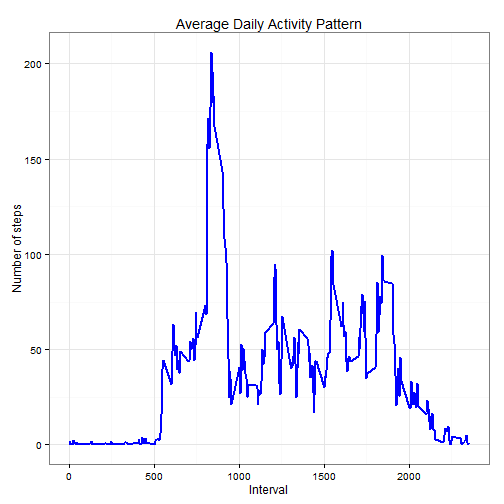
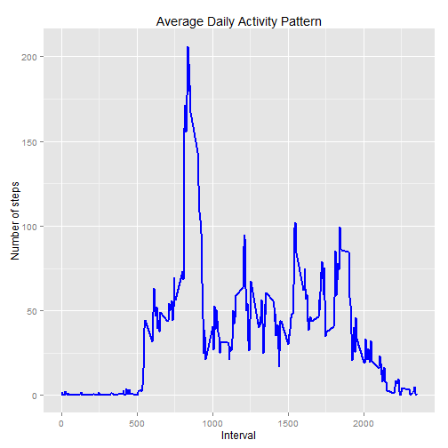
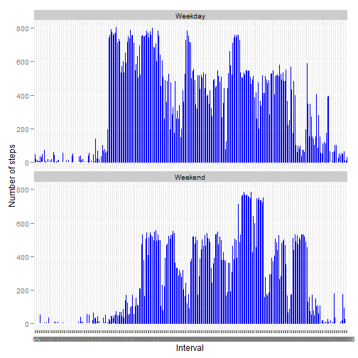

## Loading and preprocessing the data
### 1. Load the data as data frame 

```r
stepsdata<-read.csv("C:/RLanguage/data/activity.csv")
```

### 2. Tidy the data
Convert the Date variable to a Date class and interval variable to Factor Class.


```r
stepsdata$date <- as.Date(stepsdata$date, format = "%Y-%m-%d")
stepsdata$interval <- as.factor(stepsdata$interval)
```


## What is mean total number of steps taken per day?
We create a new data frame (stepsbyday) which has aggregate steps for each day and date as 2 fields. We use this data frame to calculate Mean and Median. We plot the steps per day and sum of daily steps as a histogram using ggplot. 

```r
library(ggplot2)
stepsbyday <- aggregate(steps ~ date, stepsdata, sum)
stepsMean <- mean(stepsbyday$steps, na.rm=TRUE)
stepsMedian <- median(stepsbyday$steps, na.rm=TRUE)
cat("The mean is", stepsMean, "and median is", stepsMedian)
```

```
## The mean is 10766.19 and median is 10765
```

```r
ggplot(stepsbyday, aes(x = steps)) + 
       geom_histogram(fill = "blue", binwidth = 1000) + 
        labs(title="Histogram of Steps Taken per Day", 
             x = "Number of Steps per Day", y = "Number of times in a day(Count)")
```

 


## What is the average daily activity pattern?
### 1. Time Series Plot
We create a new data frame (stepsByInterval) which has 5-minute interval and mean of steps as 2 fields. 
We plot this data frame as time series using ggplot.

```r
stepsByInterval <- aggregate(stepsdata$steps, by=list(interval = stepsdata$interval), mean, na.rm=TRUE)
stepsByInterval$interval<-as.integer(levels(stepsByInterval$interval)[stepsByInterval$interval])
colnames(stepsByInterval) <- c("interval", "steps")
ggplot(stepsByInterval, aes(x=interval, y=steps)) +   
        geom_line(color="blue", size=1) +  
        labs(title="Average Daily Activity Pattern", x="Interval", y="Number of steps") +  
        theme_bw()
```

 
### 2. Maximum Number of steps in any 5-minute interval
We determine which 5-minute interval has maximum number of steps. 


```r
maxInterval <- stepsByInterval[which.max(stepsByInterval$steps),]
cat("The ", maxInterval$interval, "interval has ", as.integer(maxInterval$steps), "steps")
```

```
## The  835 interval has  206 steps
```


## Imputing missing values
### 1. Total Number of missing values
Total number of missing values in steps field is calculated and stored in missingVals Variable


```r
missingVals <- sum(is.na(stepsdata$steps))
cat("Total Number of missing values are ", missingVals)
```

```
## Total Number of missing values are  2304
```

### 2. Strategy to fill missing values. 
We choose to replace missing values with mean value at the same interval across days. We create a funtion (fillNA) with takes 2 data frames as input and populates missing values in the first data frame using the mean value stored in the 2nd data frame in the same 5-minute interval.  

```r
fillNA <- function(data, pervalue) {
        na_index <- which(is.na(data$steps))
        na_replace <- unlist(lapply(na_index, FUN=function(idx){
                interval = data[idx,]$interval
                pervalue[pervalue$interval == interval,]$steps
        }))
        fill_steps <- data$steps
        fill_steps[na_index] <- na_replace
        fill_steps
}
```
### 3.Create a new data frame (filledData) with missing values filled using the mean of same 5-minute bin across days. 

```r
filledData <- data.frame(  
        steps = fillNA(stepsdata, stepsByInterval),  
        date = stepsdata$date,  
        interval = stepsdata$interval)

str(filledData)
```

```
## 'data.frame':	17568 obs. of  3 variables:
##  $ steps   : num  1.717 0.3396 0.1321 0.1509 0.0755 ...
##  $ date    : Date, format: "2012-10-01" "2012-10-01" ...
##  $ interval: Factor w/ 288 levels "0","5","10","15",..: 1 2 3 4 5 6 7 8 9 10 ...
```
### 4. Analysis of new data frame and comparison of results with original data frame. 

```r
filledStepsByInterval <- aggregate(filledData$steps, by=list(interval = filledData$interval), mean, na.rm=TRUE)
filledStepsByInterval$interval<-as.integer(levels(filledStepsByInterval$interval)[filledStepsByInterval$interval])
colnames(filledStepsByInterval) <- c("interval", "steps")
ggplot(filledStepsByInterval, aes(x=interval, y=steps)) +   
        geom_line(color="blue", size=1) +  
        labs(title="Average Daily Activity Pattern", x="Interval", y="Number of steps") 
```

 

```r
filledStepsbyday <- aggregate(steps ~ date, filledData, sum)
filledMean <- mean(filledStepsbyday$steps, na.rm=TRUE)
filledMedian <- median(filledStepsbyday$steps, na.rm=TRUE)

cat("The mean is", stepsMean, "and median is", stepsMedian)
```

```
## The mean is 10766.19 and median is 10765
```

```r
cat("The filled mean is", filledMean, "and filled median is", filledMedian)
```

```
## The filled mean is 10766.19 and filled median is 10766.19
```
The median differ slighly in the new data frame with filled data. The mean value is same as before. 
The new data frame mean and median value are same. 

## Are there differences in activity patterns between weekdays and weekends?
1. We create a new factor variable in the new data set indication weekday/weekend. 
2.We plot the same in in time series plots with 2 frame, one for weekday and another for weekend. We analyse the same to identify differences in activity patterns between weekdaya and weekend.  


```r
find_day <- function(date) (
ifelse (format(date, "%A") %in% c("Saturday", "Sunday"), "Weekend", "Weekday")
)
filledData$dayofweek <- find_day(as.Date(filledData$date))
filledData$dayofweek <- as.factor(filledData$dayofweek)
ggplot(filledData, aes(x=interval, y=steps))+geom_line(color="blue")+facet_wrap(~ dayofweek, nrow=2, ncol=1)+labs(x="Interval", y="Number of steps") 
```

 

The weekdays seems to be more active than weekend. The weekend has more peaks indicaties some lean periods indicating some non work related activities. 
